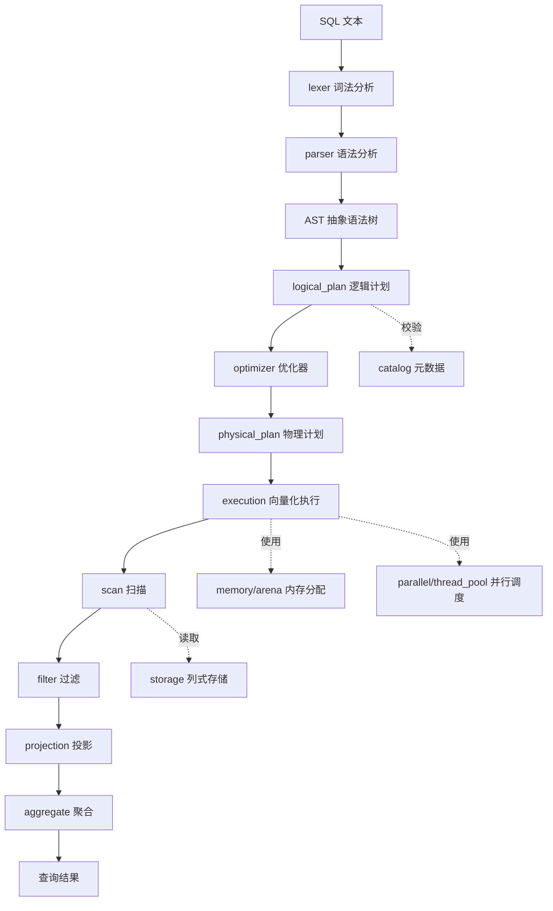

# simple_olap

一个面向分析型负载（OLAP）的列式数据库引擎，采用向量化执行架构。

## 目录结构

```
simple_olap/
├── src/
│   ├── sql/                  # SQL 前端
│   │   ├── lexer/            # 词法分析：将 SQL 文本切分为 token 流
│   │   ├── parser/           # 语法分析：将 token 流解析为 AST
│   │   └── ast/              # 抽象语法树节点定义
│   ├── planner/              # 查询规划
│   │   ├── logical_plan/     # 逻辑计划：关系代数算子树
│   │   ├── optimizer/        # 优化器：规则/代价驱动优化
│   │   └── physical_plan/    # 物理计划：可执行的算子实现选择
│   ├── storage/              # 存储引擎（列式）
│   │   ├── table/            # 表：schema、元数据、segment 集合
│   │   ├── segment/          # 数据分段：按行范围切分的存储单元
│   │   ├── column_chunk/     # 列块：segment 内单列的连续存储
│   │   ├── encoding/         # 编码压缩：RLE、字典、Delta 等
│   │   └── file/             # 文件格式：列式文件布局与读写
│   ├── execution/            # 向量化执行引擎
│   │   ├── vector/           # 列式批（Batch）与向量化类型
│   │   ├── scan/             # 扫描算子：从存储读取列数据
│   │   ├── filter/           # 过滤算子：谓词求值与行选择
│   │   ├── projection/       # 投影算子：列选择与表达式计算
│   │   └── aggregate/        # 聚合算子：GROUP BY / 聚合函数
│   ├── memory/
│   │   └── arena/            # Arena 内存分配器：批量分配与快速释放
│   ├── parallel/
│   │   └── thread_pool/      # 线程池：并行执行调度
│   └── catalog/              # 目录服务：表/列元数据管理
├── benchmark/                # 性能基准测试
├── test/                     # 单元测试与集成测试
└── tools/                    # 辅助工具（导入、调试、可视化等）
```

## 查询流水线



## 设计要点

- **列式存储**：数据按列组织（table → segment → column_chunk），配合 encoding 压缩，适合聚合类分析查询。
- **向量化执行**：以列式批（vector/Batch）为单位处理数据，提升 CPU 缓存命中率与 SIMD 利用率。
- **Arena 内存管理**：执行期内存按批分配、按查询整体释放，降低分配开销。
- **并行执行**：通过 thread_pool 对 segment 级数据切片进行并行扫描与聚合。