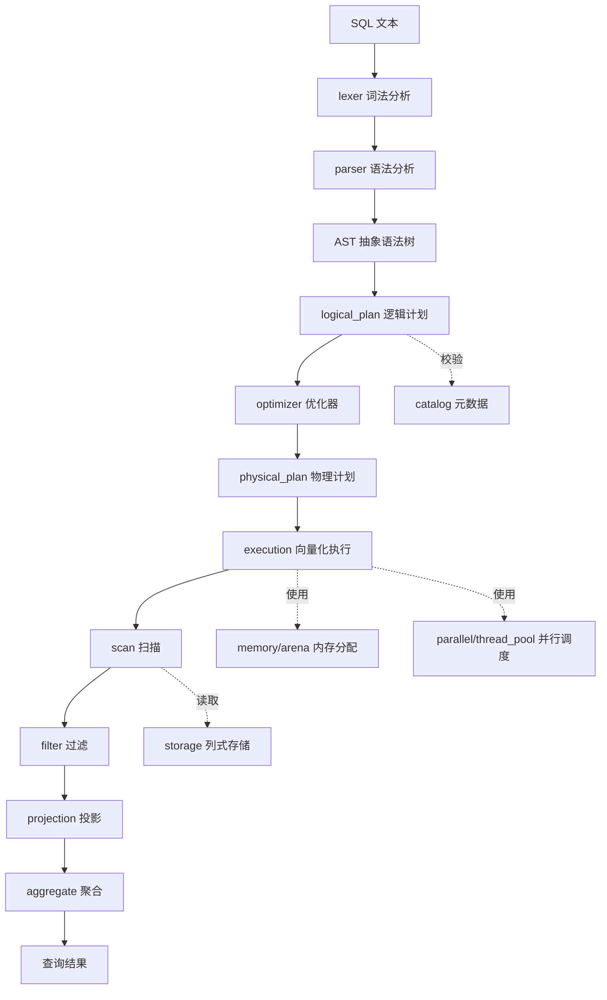

# simple_olap

一个面向分析型负载（OLAP）的列式数据库引擎，采用向量化执行架构。

## 目录结构

```
simple_olap/
├── src/
│   ├── sql/                  # SQL 前端
│   │   ├── lexer/            # 词法分析：将 SQL 文本切分为 token 流
│   │   ├── parser/           # 语法分析：将 token 流解析为 AST
│   │   └── ast/              # 抽象语法树节点定义
│   ├── planner/              # 查询规划
│   │   ├── logical_plan/     # 逻辑计划：关系代数算子树
│   │   ├── optimizer/        # 优化器：规则/代价驱动优化
│   │   └── physical_plan/    # 物理计划：可执行的算子实现选择
│   ├── storage/              # 存储引擎（列式）
│   │   ├── table/            # 表：schema、元数据、segment 集合
│   │   ├── segment/          # 数据分段：按行范围切分的存储单元
│   │   ├── index/            # 键索引：主键唯一性校验与二级键等值点查
│   │   ├── column_chunk/     # 列块：segment 内单列的连续存储
│   │   ├── encoding/         # 编码压缩：RLE、字典、Delta 等
│   │   └── file/             # 文件格式：列式文件布局与读写
│   ├── execution/            # 向量化执行引擎
│   │   ├── vector/           # 列式批（Batch）与向量化类型
│   │   ├── scan/             # 扫描算子：从存储读取列数据
│   │   ├── filter/           # 过滤算子：谓词求值与行选择
│   │   ├── projection/       # 投影算子：列选择与表达式计算
│   │   └── aggregate/        # 聚合算子：GROUP BY / 聚合函数
│   ├── simd/                 # SIMD 内核：SelectionMask / compare / arithmetic / gather
│   │   ├── scalar/           # scalar backend（总是可用）
│   │   └── avx2/             # AVX2 backend（运行时探测后覆盖安装）
│   ├── memory/
│   │   └── arena/            # Arena 内存分配器：批量分配与快速释放
│   ├── parallel/
│   │   └── thread_pool/      # 线程池：并行执行调度
│   └── catalog/              # 目录服务：表/列元数据管理
├── benchmark/                # 性能基准测试
├── test/                     # 单元测试与集成测试
└── tools/                    # 辅助工具（导入、调试、可视化等）
```

## 查询流水线



## 设计要点

- **列式存储**：数据按列组织（table → segment → column_chunk），配合 encoding 压缩，适合聚合类分析查询。
- **向量化执行**：以列式批（vector/Batch）为单位处理数据，提升 CPU 缓存命中率与 SIMD 利用率。
- **Mask-native 执行**：`SelectionMask` 是执行期唯一权威的行选择状态（`src/simd/selection_mask.h`）。
  Storage 下推谓词、Filter、Projection、Aggregate 之间直接传递 bitmap，不再出现
  `mask -> selection vector -> mask` 的往返转换；直接列投影保持零拷贝 + selection 传播
  （late materialization），只有真正需要连续输出时才物化。
- **Sparse typed gather**：Filter 之后的稀疏投影不退回逐行 `ExecValue` 物化，而是
  `SelectionMask -> SelectionCursor -> typed gather -> dense 临时批 -> 现有 SIMD 算术内核`
  （`src/simd/gather_kernel.h`，scalar / AVX2 由 `KernelRegistry` 运行时派发）。
  优化粒度保持在 column/slot：一个不可向量化的标量表达式不会迫使其余列放弃 SIMD。
- **Global Aggregate Fast Path**：无 `GROUP BY` 时不构造 `GroupKey`、不查 hash 表，
  直接更新全局聚合中间态（`HashAggregateState::AggregateMode::GLOBAL`）；
  其中 `COUNT(*)` 以 batch 为单位累加，不再逐行 `++`。空输入也输出一行
  （COUNT=0 / SUM=0 / ...），single / multi 语义一致。
- **AVX2 compare 64-row bitmap block**：每 64 行在寄存器中拼出一个完整 `uint64_t`
  bitmap，full word 一次写入（消除 8/4 次 read-modify-write）；
  对外 `CompareKernels` / `KernelRegistry` 接口不变。
- **Arena 内存管理**：执行期内存按批分配、按查询整体释放，降低分配开销。
- **并行执行**：通过 thread_pool 对 segment 级数据切片进行并行扫描与聚合。
- **键索引**：`PRIMARY KEY` 在 `TableStorage::Append` 统一校验唯一性（任何写入口都无法绕过）；
  完整等值条件由物理计划选择 IndexScan 点查。索引只存内存并随 `catalog.meta` 持久化键定义，
  重启时从 segment 重建，避免索引文件与数据的一致性问题。

## 测试与基准

```bash
cmake -S . -B build -DCMAKE_BUILD_TYPE=Release
cmake --build build -j

# 正确性
./build/bin/simd_compare_test      # kernel / SelectionMask / SelectionCursor / 64-row 边界
./build/bin/gather_kernel_test     # typed gather: scalar vs AVX2，各选择率
./build/bin/mask_pipeline_test     # Filter/Projection/Aggregate 的 dense + sparse 路径
./build/bin/global_aggregate_test  # 空表 / 过滤选择率 / expression / GROUP BY / single==multi

# 性能
./build/bin/bench_selection_pipeline  # mask-native vs selection-vector 往返
./build/bin/bench_sparse_projection   # mask gather vs 旧逐行物化（kernel-only / pipeline）
./build/bin/bench_compare_kernel      # scalar / 64-row bitmap block / 旧逐段|= 写法
./build/bin/bench_global_aggregate    # hash 表路径 vs Global Fast Path（consume / full）
./build/bin/bench_arith_kernel        # projection 算术内核 micro-bench
./build/bin/bench_perf_counters       # perf_event_open: cycles / IPC / LLC miss / branch miss
./build/bin/bench_parallel_scan       # 并行扫描（input/output rows/s + median speedup）

# 端到端查询 + 统一实验矩阵
./build/bin/bench_query_workload      # engine / prepared / materialized QPS + P50/P95/P99 + 内存池增量
./benchmark/verify_simd.sh            # scalar/AVX2、single/multi 的 ResultDigest 正确性校验
./benchmark/run_perf_suite.sh         # 一键跑 QPS / 并行扩展 / AVX2 / 内存消融，输出 CSV
./benchmark/run_perf_suite.sh --quick # 快速自检（小数据 / 短时长）
```

`bench_query_workload` 是唯一的端到端计时口径，并把三条路径严格分开：

| `--result-mode` | 计时区间 | 含义 |
| --- | --- | --- |
| `engine` | `Connection::Execute(sql, consumer)` | SQL 前端 + planning + execution（blackhole consumer，不物化结果） |
| `prepared` | `Connection::Execute(prepared, consumer)` | execution-only（planning 在测量前完成） |
| `materialized` | `Connection::Query(sql)` | engine + `QueryResult` 全量深拷贝 |

`both`（默认）同时报告 engine 与 materialized，`all` 再加 prepared。
每个 client 独立记录 latency 样本，结束后 merge；QPS = 窗口内完成 query 数 /
真实 elapsed；P99 样本不足 1000 时明确标记 `insufficient samples`。测量前用与
行序无关的 `ResultDigest` 校验三条路径结果一致，否则 abort。它使用固定数据集
`perf_data`（`id / group_low / group_high / value / value2`，无索引）与固定 5 条
workload（见源文件头注释）。

AVX2 A/B 与内存消融均由 `run_perf_suite.sh` 用同一二进制、独立进程完成，且
A/B 顺序按轮次交错，避免固定顺序偏差：

- AVX2：`SIMPLE_OLAP_FORCE_SCALAR=1` vs 默认；
- 内存：`M0` system + direct BufferPool → `M1` Arena → `M2` Arena + BlockPool
  → `M3` + BufferPool（`--memory` / `--buffer-mode` 切换）；
- CSV 列与按配置 median 的汇总见 `benchmark/results/`，详细说明见
  `benchmark/README.md`。

## 键语法

```sql
CREATE TABLE users (
    id INT PRIMARY KEY,        -- 列级主键
    age INT,
    city VARCHAR,
    KEY idx_age (age)          -- 二级键（非唯一，仅加速等值查询）
);

CREATE TABLE orders (
    user_id INT,
    order_id INT,
    amount DOUBLE,
    PRIMARY KEY (user_id, order_id),   -- 复合主键
    KEY idx_amount (amount)
);
```

第一版只优化「键列全部为等值条件」的查询；范围查询与不完整复合键继续走 SeqScan。